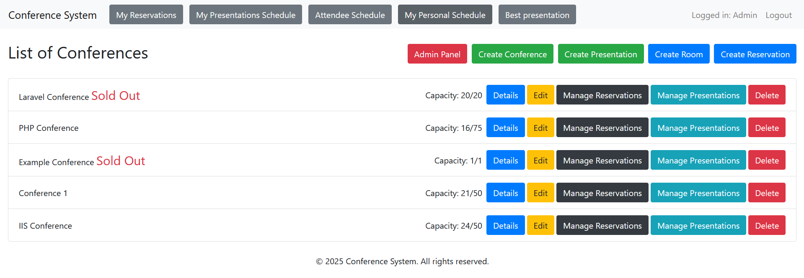

# Conference Management System (IIS Project)

A web application for managing conferences. It supports user registration, session scheduling, room and presentation management, and features for voting and submitting questions during presentations.

## Authors

- **Peter Gvozdják** – User authentication, conference/room/presentation management, voting  
   xgvozd00@stud.fit.vutbr.cz  
- **Mário Perecz** – Database layer, reservation system, conference detail view, question submission  
   xperec00@stud.fit.vutbr.cz  
- **Lukáš Selický** – Admin panel, presentation schedule, personal agenda, data seeding  
   xselic00@stud.fit.vutbr.cz

  ## Test Accounts

| Login                  | Password | Role       |
|------------------------|----------|------------|
| admin@example.com      | password | Admin      |
| speaker@example.com    | password | Speaker    |
| organizer@example.com  | password | Organizer  |
| guest1@example.com     | password | Guest      |
| guest2@example.com     | password | Guest      |

## Features Overview

- **User Roles**: Admin, Organizer, Speaker, Guest
- **Conference Management**: Creation, editing, scheduling
- **Presentation Management**: Submission, scheduling, voting
- **Room Management**: Add/edit rooms and assign to conferences
- **Reservations**: Book and view sessions
- **Questions & Voting**: Ask questions during sessions, vote for best presentation
- **Personal Schedule**: Attendee-specific session planner

- ### Requirements

- PHP 8.2+
- Composer
- NPM
